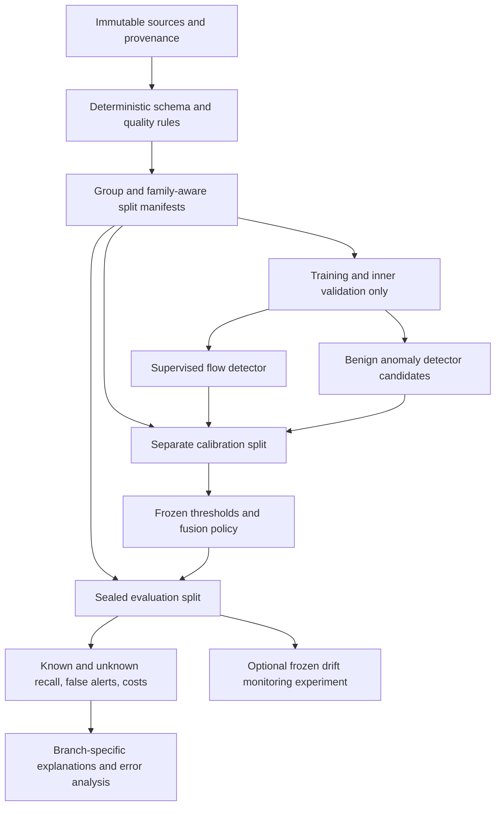

# Proposed methodology — protocol v0.1

Status: design proposal, not a completed or novel validated method. Pilot results have already been inspected; their partitions cannot serve as an untouched final evaluation.

## Scope and hypotheses

Task: flow-based binary network intrusion detection with attacks from deliberately excluded families at evaluation. “Unknown” means absent from model training, hyperparameter selection, preprocessing fitting and threshold calibration. It does not mean a newly discovered exploit. Detecting maliciousness is different from assigning the correct unknown attack name.

H1: a benign anomaly detector can recover supervised misses at an acceptable *total* false-alert cost. H2: apparent gains depend on split quality, port shortcuts and dataset defects. H3: explanation patterns are stable enough across seeds and environments to support limited analyst interpretation. Null/negative results are valid; retain no branch solely because it looks sophisticated.

## Framework

### Data contract

Preserve raw files and checksums. Reconstruct source-file provenance; normalize schema and label encoding; log invalid values, duplicate columns, feature duplicates and label conflicts. Use corrected releases as a required sensitivity analysis. Primary predictors exclude identifiers, timestamps and destination port; include a port-on ablation to measure shortcut sensitivity. Source/day/session metadata defines splits only.

Apply learned operations after splitting: imputation, scaling, constant removal, correlation selection and representation learning. Prefer no target-based feature selection initially. If selection is studied, nest it inside each training fold and persist its fitted state. Never fit transforms on a concatenated train/test dataframe. Never use unknown evaluation labels to choose features, thresholds, clusters or epochs.

### Model candidates

Supervised: scaled/class-balanced logistic regression, random forest, GPU histogram XGBoost, and scaled MLP. Equalize access to tuning data and report search budgets; equal trial count need not imply equal compute. An optional compact FT-Transformer follows only if strong basic controls are complete.

Benign anomaly models: distance to MiniBatchKMeans centroids, Isolation Forest and a small reconstruction AE. Add locally normalized centroid distance as a predeclared ablation if cluster density varies strongly. Fit benign transforms and models on benign training data only. Development selection can use known attacks or inner pseudo-unknown families; final held-out families remain excluded. Include a faithful SHAP-representation/AE baseline from the closest literature if claiming a contribution over it.

KMeans partitions a representation; its clusters do not automatically correspond to new attacks. A distance/density score and independent benign threshold are necessary. AE reconstruction error also does not automatically distinguish all attacks. Neither the supervisor's redundancy claim nor the draft's AE necessity is established without complementary-detection tests.

### Calibration and fusion

For a high-is-anomalous score and n benign calibration examples, use the ascending order statistic at `ceil((n+1)*(1-alpha))` with strict `score > threshold`. If the rank exceeds n, use an infinite threshold rather than silently claiming a feasible guarantee. Handle ties explicitly. This can support marginal control under suitable exchangeability assumptions; time dependence and domain shift weaken those assumptions.

Evaluate total false-positive budgets alpha = 0.001, 0.005, 0.01, 0.02. A single model receives the full budget. For an OR union, allocate alpha_s + alpha_a <= alpha; a union-bound argument does not require independent branches, but each branch's calibration assumptions still matter. Equal allocation is a baseline, not an optimized solution. Select any allocation using inner development data, then freeze and calibrate on separate benign data. Include allocation endpoints (supervised only/anomaly only).

An alternative joint-score/fusion model requires its own training/selection/calibration partitions. Do not tune an OR rule on final test recall. Publish actual test FPR with uncertainty; nominal calibration budget is not a guarantee of the realized test FPR.

Branch complementarity must compare: supervised full-budget performance; supervised at the union's branch threshold; anomaly-only; union; and the number of *additional* unknown detections versus additional benign alerts. Report both absolute counts and rates. A branch that rescues some misses can still make the total-budget system worse.

### Explanations

Use TreeSHAP for the supervised tree model only. Record explanation output space, background sample, feature-dependence assumption and library version. Explain anomaly alerts with a method appropriate to that detector; reconstruction-error components or centroid distances may be shown as diagnostics, but do not label them TreeSHAP or causal explanations.

Measure top-k overlap/rank stability across seeds and bootstrap samples, conditional on matched populations. Include false positives, false negatives and unknown-family examples selected by a predeclared policy. Test sensitivity to correlated feature groups. Masking experiments must avoid impossible flow combinations or state that they are only model perturbations. SHAP associations do not establish causal attack mechanisms or automatic attack-category discovery.

### Drift (optional secondary question)

Separate covariate change P(X), class-prior change P(Y), and concept change P(Y|X). PSI alone demonstrates none of the latter two. Fit bins and smoothing rules on reference training data; use benign-to-benign comparisons to reduce class-mixture confounding, report bin sensitivity and calibrate false alarms on stationary windows. Compare KS/Wasserstein or another simple monitor using the same windows.

Use actual chronological data for detection-delay claims. Cross-dataset discrepancies also reflect extraction/schema differences. Call the result domain shift when temporal causality is unestablished. A fixed PSI value of 0.2 is a heuristic, not a statistical significance test. Retraining/adaptation requires a separate experiment including label availability, delay, compute and before/after error.

## Decisions on the supervisor's suggestions

- Test clustering as a cheap alternative and retain AE as a controlled baseline until evidence supports removal. The pilot already shows that clustering is not automatically sufficient for held-out web attacks.
- Use an FT-Transformer only as an optional tabular baseline. It does not inherently confer open-set detection.
- Generic LLM/BERT/T5 inputs are poorly matched to these numeric flow tables. Packet-sequence pretraining or HTTP/log language models require suitable new data, threat definitions and privacy/labeling work; they constitute a different project scope.
- Narrow the paper to network-flow IDS. Restore an e-commerce-specific claim only after application-specific data and evaluation substantiate it.
